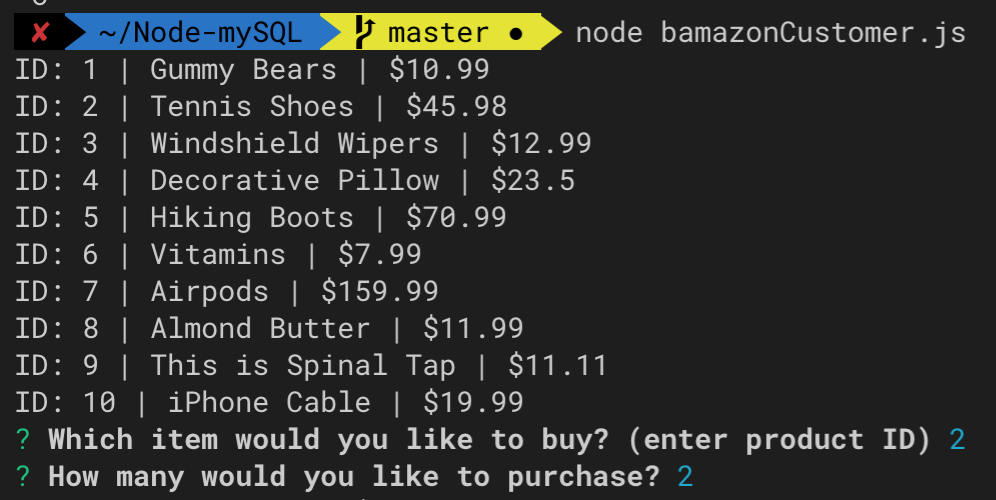
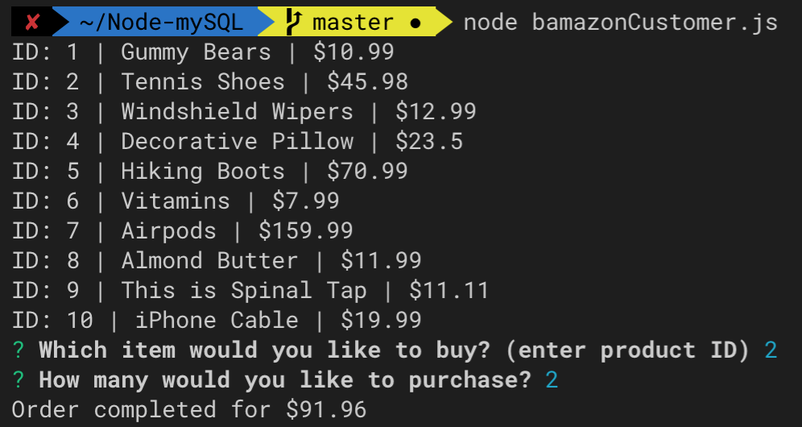
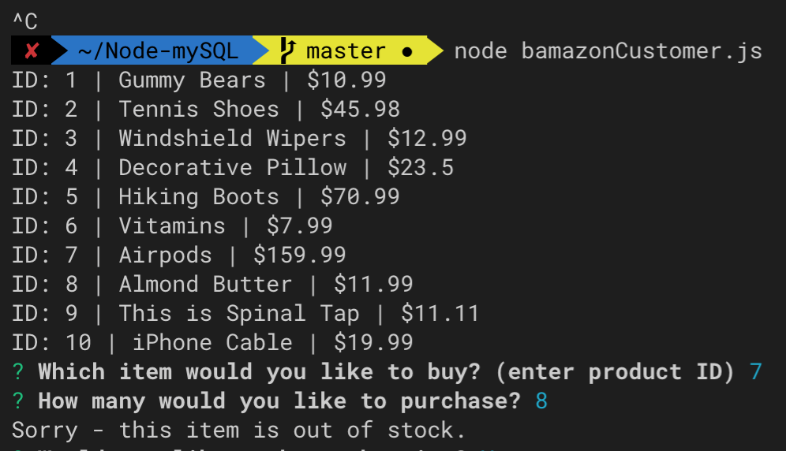
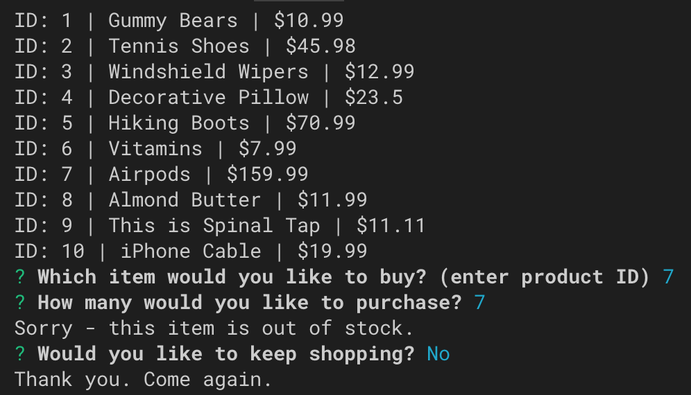

# Node-mySQL

## Contributors
@bwillstorey

## Technology
- mySQL, Node, Inquirer

## About
An Amazon-like storefront using Node. Users have the ability to view a current list of inventory from the SQL database and are asked questions on the command line using Node and Inquirer about which product they would like to purchase and the quantity they would like to purchase. 

### bAmazon start  
  

The database has set quantities of each item and will validate if the item is in stock before confirming the purchase. An error will be returned if the quantity to be purchased exceeds the number available in inventory. 

### bAmazon Purchase success  

### bAmazon Purchase Fail  

Users that have a successful purchase will receive their total due and be prompted using Inquirer if they would like to continue shopping for other items or finish shopping. If continuing, the user will be returned to product selection.

### bAmazon Continue Shopping  

### bAmazon Stop Shopping  

## Contributing Guidelines
All contributions and suggestions are welcome! For direct contributions, please fork the repository and file a pull request.

## Contact
#### Developer/Full-stack Web Software Developer
- Homepage: https://brianstorey.me
- email: bwillstorey@gmail.com
- LinkedIn: https://www.linkedin.com/in/brianstorey/
- AngelList: https://angel.co/brian-storey
